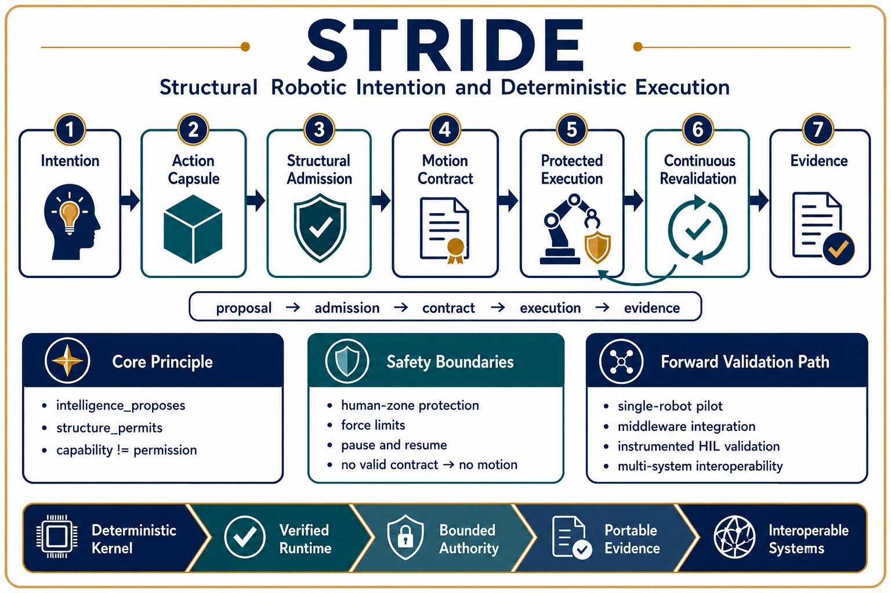
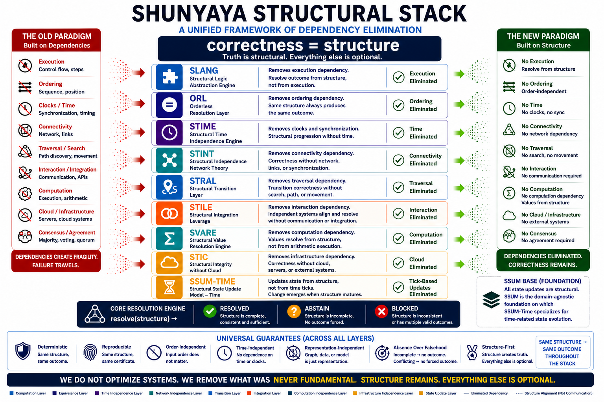

# ⭐ **STRIDE**

## **Structural Robotic Intention and Deterministic Execution**

### **Any intelligence may propose. Only admissible structure may authorize motion.**


[](https://github.com/OMPSHUNYAYA/STRIDE/actions/workflows/stride-verify.yml)

---

**Should increasingly capable intelligence also receive direct physical authority?**

STRIDE explores a structure-first boundary between robotic intention and physical execution.

Traditional robotic flow often approaches:

`command -> controller -> motion`

STRIDE explores:

`proposal -> structural_admission -> motion_contract -> protected_execution -> controller -> evidence`

Core principle:

`intelligence_proposes; structure_permits`

Foundational separation:

`intention != execution_permission`

---

# 🔍 **Positioning and Scope**

STRIDE is an open reference implementation and structural robotics observatory.

It explores whether a robotic action should be permitted only after its intention, world state, policy, limits, and recovery structure are resolved into deterministic physical authority.

A proposal may originate from:

- a human operator
- an artificial intelligence model
- a motion planner
- a vision system
- a remote controller
- an automation script
- another robot
- an autonomous decision system

No proposal receives direct authority merely because it exists.

STRIDE does **not** replace:

- robot controllers
- certified safety functions
- emergency stops
- physical guarding
- collision avoidance
- motion planning
- perception systems
- operator training
- regulatory safety processes

STRIDE explores a narrower structural question:

**Can physical execution authority be separated from the intelligence that proposes an action?**

---

# ⚡ **The Core Principle**

Traditional:

`command_exists -> motion_may_begin`

STRIDE:

`motion_allowed iff valid_motion_contract_exists`

Related laws:

`capability != permission`

`command != permission`

`confidence != permission`

`reachable != contact_admissible`

`path_exists != path_admissible`

`generated_action != authorized_motion`

An action may be physically possible while remaining structurally unauthorized.

---

# 🧩 **Structural Admission Model**

STRIDE evaluates four primary structures:

`decision = admit(A, W, P, R)`

Where:

- `A` = Structural Action Capsule
- `W` = World Snapshot
- `P` = Policy Structure
- `R` = Runtime Structure

A simplified mandatory-condition model is:

`M = goal_complete * world_consistent * path_admissible * human_safe * contact_admissible * limits_compliant * recovery_available`

Each factor represents a mandatory structural condition:

* `goal_complete` = goal completeness
* `world_consistent` = world consistency
* `path_admissible` = path admissibility
* `human_safe` = human-zone safety
* `contact_admissible` = contact admissibility
* `limits_compliant` = force and speed compliance
* `recovery_available` = recovery availability

Critical conditions are not averaged.

`any_required_factor_unresolved -> no_forced_motion`

---

# 📦 **Structural Action Capsule**

A robotic action is represented as a bounded physical intention rather than a bare command.

A simplified capsule is:

`A = (actor, action, target, source, destination, path, contact, force, recovery)`

The capsule may identify:

- robot identity
- action type
- target identity
- source and destination
- admissible path
- contact authority
- force and speed limits
- protected human zones
- required sensors
- recovery action
- completion condition
- expiration condition
- policy identity

The capsule makes the proposal explicit.

It does not itself authorize motion.

---

# 🌐 **World Snapshot**

The action capsule is evaluated against a canonical world snapshot.

A simplified snapshot is:

`W = (objects, humans, obstacles, sensors, robot_state, workspace)`

The snapshot may include:

- observed objects
- target candidates
- obstacle locations
- human presence
- protected zones
- path occupancy
- sensor health
- sensor freshness
- robot state
- gripper state
- controller state
- emergency-stop state
- workspace boundaries

Conflicting mandatory observations are not silently averaged.

`conflicting_required_observations -> CONFLICT`

Expired required evidence does not remain valid.

`expired_required_evidence -> INCOMPLETE`

---

# 🛡️ **Policy Structure**

The policy structure defines what may occur within a declared operating domain.

A simplified policy is:

`P = (permissions, limits, boundaries, evidence_requirements)`

Policies may define:

- permitted actions
- approved objects
- prohibited objects
- workspace limits
- protected zones
- maximum speed
- maximum acceleration
- maximum contact force
- required sensors
- pause conditions
- abort conditions
- recovery requirements
- expiration rules

Policy identity is immutable across silent changes.

`policy_change -> new_policy_identity`

---

# 🚦 **Admission States**

STRIDE resolves an action into a finite structural state.

- `RESOLVED`
- `INCOMPLETE`
- `CONFLICT`
- `FORBIDDEN`
- `PAUSED`
- `ABORTED`
- `COMPLETED`

## **RESOLVED**

The required structure is complete, consistent, policy-compliant, and admissible.

`RESOLVED -> bounded_motion_may_begin`

## **INCOMPLETE**

Required information is missing, stale, ambiguous, or insufficient.

`INCOMPLETE -> HOLD`

## **CONFLICT**

Two or more required structures disagree.

`CONFLICT -> HOLD`

## **FORBIDDEN**

The action violates an explicit rule or protected boundary.

`FORBIDDEN -> REJECT`

## **PAUSED**

The action was previously admitted, but continuing conditions no longer hold.

`EXECUTING + invalidated_condition -> PAUSED`

## **ABORTED**

Execution cannot continue or recover within the existing contract.

`unrecoverable_runtime_change -> ABORTED`

## **COMPLETED**

The declared completion condition has been satisfied.

`completion_condition_satisfied -> COMPLETED`

---

# ⏸️ **Valid Non-Movement**

STRIDE treats non-movement as a valid robotic outcome.

If the target is ambiguous:

`admission = INCOMPLETE`

If required sensors disagree:

`admission = CONFLICT`

If a protected boundary would be violated:

`admission = FORBIDDEN`

If a previously valid action becomes unsafe:

`admission = PAUSED`

The robot is not required to guess.

Core law:

`absence_of_permission -> absence_of_motion`

---

# 📜 **Motion Contract**

When an action is resolved, STRIDE produces a bounded Motion Contract.

The contract may define:

- exact robot
- exact target
- exact action
- authorized path
- workspace limits
- permitted contact
- speed limit
- force limit
- human-zone condition
- sensor requirements
- stop conditions
- pause conditions
- abort conditions
- recovery action
- completion condition
- policy identity
- contract fingerprint

Core law:

`permission = exact_action + exact_limits + exact_context`

STRIDE does not issue broad authority such as:

`movement_approved`

It issues bounded authority tied to one declared action and one declared context.

---

# 🔁 **Continuous Structural Validity**

Admission before execution is necessary but not sufficient.

The world may change while the robot is moving.

STRIDE therefore evaluates continuing authority during execution.

Examples:

- a human enters a protected zone
- an obstacle enters the path
- a required sensor becomes stale
- a controller state changes
- a motion contract expires
- the world no longer matches the admitted snapshot

Core law:

`previous_permission != permanent_permission`

Runtime transition:

`world_change -> authority_revalidation`

Resume requires renewed structural validity.

`PAUSED + renewed_validity -> RESUME`

---

# 🎯 **Demonstrated Runtime Sequence**

The reference observatory demonstrates:

`select -> admit -> approach -> contact -> attach -> lift -> transfer -> place -> release -> return_home -> complete`

The selected object is carried by the gripper during lift and transfer.

The object is released at the declared destination.

Completion ends active scheduling and seals the final evidence state.

---

# 🖥️ **Interactive STRIDE Observatory**

[Open the STRIDE v1.1.3 reference observatory](demo/STRIDE_v1_1_3.html)

The self-contained HTML demonstrates:

- structural action selection
- deterministic admission
- ambiguity handling
- sensor conflict handling
- protected human-zone enforcement
- contact authorization
- force-limit enforcement
- bounded motion contracts
- robot-object transfer
- runtime pause
- structural revalidation
- completion evidence
- performance monitoring
- on-demand qualification
- downloadable release artifacts

The observatory is fully offline after download.

Modern browsers may restrict some direct `file://` behavior.

Running a local server is therefore recommended.

---

# ⚡ **90-Second Structural Proof**

From the repository root:

**Windows**

```bat
python -m http.server 8000
```

**macOS / Linux**

```bash
python3 -m http.server 8000
```

Launch STRIDE through the local server.

After starting the server, copy or enter this address in your browser:

`http://localhost:8000/demo/STRIDE_v1_1_3.html`

This address works only while the local server is running.

Inside the observatory:

1. Select **RESOLVED**.
2. Press **EVALUATE**.
3. Confirm the admission state is `RESOLVED`.
4. Press **EXECUTE**.
5. Observe the complete transfer sequence.
6. Confirm the final state is `COMPLETED`.
7. Press **RUN 346-CASE AUDIT**.
8. Confirm `346 / 346` cases pass.
9. Confirm `unsafe_admissions = 0`.

---

# 🚀 **Quick Start**

Detailed step-by-step instructions:

[Read the STRIDE Quickstart](docs/Quickstart.md)

---

# ✅ **Release Verification**

The release exposes:

`STRIDE.version()`

`STRIDE.release()`

`STRIDE.releaseManifest()`

`STRIDE.releaseAudit()`

`STRIDE.runtimeStatus()`

`STRIDE.uiAudit()`

`STRIDE.coreAudit()`

`STRIDE.performanceAudit()`

`STRIDE.viewportAudit()`

`STRIDE.geometryStatus()`

`STRIDE.audit()`

Minimal release check:

```javascript
console.log(STRIDE.version());
console.log(STRIDE.releaseAudit());
```

Expected:

`version = 1.1.3`

`releaseAudit().allPass = true`

Full qualification:

```javascript
(async () => {
  const report = await STRIDE.audit();

  console.table({
    runtime_release_version: report.runtime_release_version,
    inherited_kernel_version: report.inherited_kernel_version,
    qualification_suite_id: report.qualification_suite_id,
    allPass: report.allPass,
    total_case_count: report.total_case_count,
    unsafe_admissions: report.unsafe_admissions
  });
})();
```

Expected:

`runtime_release_version = 1.1.3`

`inherited_kernel_version = 1.0.1`

`qualification_suite_id = stride.qualification/346`

`allPass = true`

`total_case_count = 346`

`unsafe_admissions = 0`

Complete verification instructions:

[Verify the frozen STRIDE release](VERIFY/VERIFY.txt)

---

# 📊 **Qualification Status**

Frozen release result:

- runtime release: `1.1.3`
- inherited qualification kernel: `1.0.1`
- qualification suite: `stride.qualification/346`
- total cases: `346`
- passed cases: `346`
- unsafe admissions: `0`
- artifact SHA-256: `4550091e1da5e3e6fcf54f9d641d46ca1b9200045e0f221d60cf415de633049f`
- release audit: `PASS`

The verification worker remains unloaded during normal startup.

It is created only when qualification is requested.

Core performance law:

`optimization_must_not_change_admission_truth`

Read the official evidence:

- [Qualification Summary](evidence/QUALIFICATION_SUMMARY.md)
- [Expected Results](evidence/EXPECTED_RESULTS.json)
- [Frozen Qualification Report](evidence/STRIDE_v1_1_3_346_Case_Qualification_Report.json)
- [Release Manifest](evidence/STRIDE_v1_1_3_RELEASE_MANIFEST.json)

---

# 🧭 **Architecture**



STRIDE places a structural authority boundary between intention and execution:

intelligence or operator

↓

proposed intention

↓

structural action capsule

↓

world snapshot

↓

policy structure

↓

deterministic admission

↓

bounded motion contract

↓

protected execution boundary

↓

controller

↓

evidence

Architecture details:

- [STRIDE Architecture Notes](docs/STRIDE-Architecture-Notes.md)
- [Motion Contract](docs/STRIDE-Motion-Contract.md)
- [Runtime State Model](docs/STRIDE-Runtime-State-Model.md)

---

# 🏛️ **Foundational Structural Stack**



STRIDE is part of the broader Shunyaya structural ecosystem.

Its specific contribution is the separation of intelligence from physical execution authority.

`intelligence -> proposal`

`structure -> permission`

`controller -> bounded_execution`

---

# 🧾 **Structural Vocabulary**

| Term | Meaning |
|---|---|
| `proposal` | requested physical intention |
| `action_capsule` | canonical structured intention |
| `world_snapshot` | canonical relevant environment state |
| `policy_structure` | declared permissions, limits, and boundaries |
| `admission` | deterministic structural decision |
| `motion_contract` | bounded physical execution authority |
| `RESOLVED` | admissible structure |
| `INCOMPLETE` | required structure missing or ambiguous |
| `CONFLICT` | required structures disagree |
| `FORBIDDEN` | explicit policy or boundary violation |
| `PAUSED` | continuing authority temporarily withdrawn |
| `ABORTED` | execution cannot safely continue |
| `COMPLETED` | completion condition satisfied |
| `certificate` | deterministic evidence identity |

---

# 🔐 **Deterministic Invariants**

`same_structure + same_policy -> same_admission`

`non_resolved_structure -> no_motion_contract`

`no_valid_motion_contract -> no_authorized_motion`

`human_in_protected_zone -> no_continuing_motion`

`requested_force > permitted_force -> FORBIDDEN`

`motion_admitted -> safe_stop_or_recovery_defined`

`world_change -> authority_revalidation`

`same_structure + conforming_kernel -> same_admission`

---

# 🔥 **Break STRIDE**

Attempt to produce:

- the same structure with a different admission
- a non-resolved action with a motion contract
- an excessive-force request that becomes admitted
- a protected-zone violation that continues moving
- a stale observation that remains silently valid
- a paused action that resumes without revalidation
- a replayed authority that executes twice
- an altered policy with the same identity
- a completed action with an active scheduler
- an unsafe admission within the qualification suite

Invariant under test:

`motion_allowed iff valid_motion_contract_exists`

---

# ⚠️ **Scope and Claim Boundary**

Current maturity:

`reference_architecture_validated`

STRIDE v1.1.3 demonstrates:

- deterministic structural admission
- separation of intention and execution authority
- bounded motion contracts
- runtime validity monitoring
- safe pause and structural revalidation
- simulated robot-object interaction
- reproducible browser-based qualification

STRIDE v1.1.3 does **not** claim:

- certified functional safety
- real robot validation
- measured physical stopping performance
- real actuator isolation
- secure production cryptography
- regulatory approval
- unrestricted human-robot interaction
- production deployment
- civilization-grade adoption

Governing boundary:

`reference_architecture_validated != production_safety_certified`

Read:

- [STRIDE Claim Boundary](docs/STRIDE-Claim-Boundary.md)
- [STRIDE Known Limitations](docs/STRIDE-Known-Limitations.md)
- [STRIDE Reproduction Protocol](docs/STRIDE-Reproduction-Protocol.md)

---

# 📚 **Documentation**

## **Start Here**

- [Quickstart](docs/Quickstart.md)
- [Frequently Asked Questions](docs/FAQ.md)
- [STRIDE Challenge](docs/STRIDE-Challenge.md)


## **Architecture and Structural Model**

* [STRIDE Architecture Notes](docs/STRIDE-Architecture-Notes.md)
* [Motion Contract](docs/STRIDE-Motion-Contract.md)
* [Runtime State Model](docs/STRIDE-Runtime-State-Model.md)
* [Resolution Guarantees](docs/STRIDE-Resolution-Guarantees.md)


## **Release Boundary and Reproduction**

- [Claim Boundary](docs/STRIDE-Claim-Boundary.md)
- [Known Limitations](docs/STRIDE-Known-Limitations.md)
- [Reproduction Protocol](docs/STRIDE-Reproduction-Protocol.md)

## **Visual References**

- [STRIDE Architecture Diagram](docs/STRIDE-Diagram.png)
- [Shunyaya Structural Stack](docs/Shunyaya-Structural-Stack.png)

---

# 🧪 **Evidence**

- [Release Manifest](evidence/STRIDE_v1_1_3_RELEASE_MANIFEST.json)
- [346-Case Qualification Report](evidence/STRIDE_v1_1_3_346_Case_Qualification_Report.json)
- [Qualification Summary](evidence/QUALIFICATION_SUMMARY.md)
- [Expected Results](evidence/EXPECTED_RESULTS.json)

The evidence directory contains frozen release artifacts.

It is not a substitute for independent reproduction.

---

# 🔎 **Verification Artifacts**

- [Verification Procedure](VERIFY/VERIFY.txt)
- [Frozen Demo SHA-256](VERIFY/FREEZE_DEMO_SHA256.txt)
- [Release Checklist](VERIFY/RELEASE_CHECKLIST.md)

From the repository root on Windows:

```bat
certutil -hashfile demo\STRIDE_v1_1_3.html SHA256
```

On macOS or Linux:

```bash
sha256sum demo/STRIDE_v1_1_3.html
```

Compare the result with:

[Frozen Demo SHA-256](VERIFY/FREEZE_DEMO_SHA256.txt)

---

# 📜 **License**

See:

[STRIDE License](LICENSE)

The reference implementation is intended for open inspection, study, reproduction, validation, and independent implementation under the terms stated in the license.

No use of this repository should be represented as certified physical safety merely because the reference observatory or qualification suite passes.

---

# 🧠 **Core Observation**

More capable intelligence does not remove the need for an independent physical authority boundary.

A robot may understand.

A robot may plan.

A robot may predict.

A robot may remain unauthorized to move.

STRIDE explores the principle that physical execution should follow admissible structure rather than capability alone.

---

# 🌌 **Final Insight**

Intelligence may propose.

Structure must permit.

The controller may execute only what structure has permitted.

`intention != execution_permission`

`capability != permission`

`absence_of_permission -> absence_of_motion`

**This is structural robotic authority.**

**This is STRIDE.**
